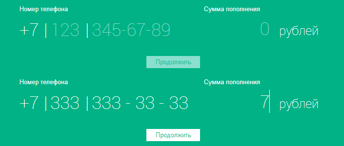

---
* [x] в input'ах должен быть placeholder, цвет placeholder'а #8adfce
* [x] требуется валидация данных по мере ввода символов. Т.е. можно ввести только валидные символы, остальные просто не вводятся. Цвет текста #ffffff
* [x] при вводе данных, если input заполнен, фокус должен переходить на следующий input автоматически
* [x] должен работать переход между инпутами по backspace, при удалении символов, за исключением поля сумма - из него перехода не должно быть, так же должен работать первод каретки стрелками в клавиатуре.
* [x] сумма платежа не может быть меньше 1 рубля и больше 5000р.
* [x] слово "рубль" должно соответствовать числительному (1 рубль, 2 рубля, 7 рублей, 52 рубля и т.д.)
* [x] Изначально, кнопка "отправить" должна быть заблокирована (цвет фона #8adfce, отправка данных не происходит), при корректно заполненной форме, должна разблокироваться (цвет фона кнопки #ffffff)
* [x] должна работать вставка номера из буфера.
